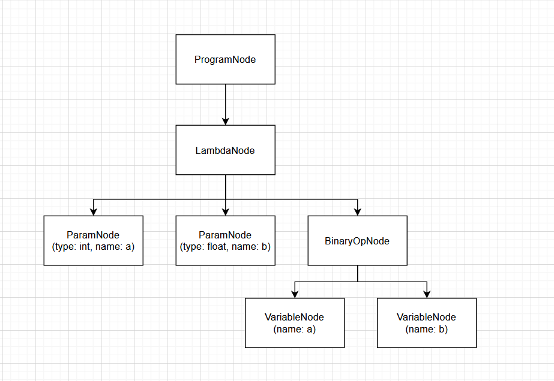
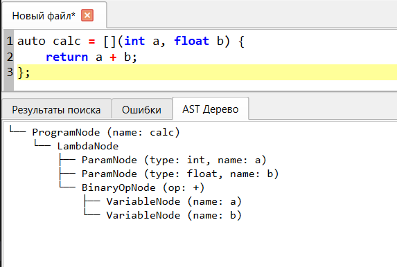

# Лабораторная работа №5: Построение AST и проверка контекстно-зависимых условий

**Автор:** Гетман Денис Андреевич  
**Группа:** АВТ-314  
**Вариант:** Программа синтаксического анализа лямбда-функций C++  

## 1. Цель работы
Изучить назначение и принципы работы семантического анализатора в структуре компилятора. Освоить методы построения абстрактного синтаксического дерева (AST) и проверки контекстно-зависимых условий (семантических правил) для заданной синтаксической конструкции.

## 2. Вариант задания
Синтаксическая конструкция лямбда-функций C++: `auto calc = [](int a, float b) { return a + b; };`

Примеры верных строк:
- `auto foo = [](int x) { return x * 10; };`
- `auto bar = [](int param1, float param2) { return param1 + param2 / 2; };`

## 3. Контекстно-зависимые условия (Семантические правила)

Реализованы следующие семантические проверки для лямбда-функций:

1. **Уникальность идентификаторов (параметров):**
   Проверяется, что имена параметров внутри лямбда-функции уникальны. 
   - *Пример ошибки:* `auto calc = [](int a, float a) { return a; };`
   - *Ожидаемое сообщение:* `Ошибка: идентификатор "a" уже объявлен ранее`

2. **Использование объявленных идентификаторов:**
   Проверяется, что любая переменная, используемая в выражении `return`, была предварительно объявлена в списке параметров.
   - *Пример ошибки:* `auto calc = [](int a) { return a + b; };`
   - *Ожидаемое сообщение:* `Ошибка: идентификатор "b" не был объявлен ранее`

3. **Допустимые значения (границы):**
   Проверяется, что используемые целочисленные константы не превышают лимиты 32-битного числа (максимум 2147483647).
   - *Пример ошибки:* `auto f = [](int a) { return a + 3000000000; };`
   - *Ожидаемое сообщение:* `Ошибка: значение 3000000000 превышает допустимый предел для int`

4. **Совместимость типов (Вычисление):**
   В рамках текущей грамматики поддерживаются целочисленные и вещественные типы, которые неявно совместимы друг с другом для арифметических операций (`+`, `-`, `*`, `/`). Дополнительная проверка не требуется, но тип сохраняется в `SymbolTable`.

## 4. Структура AST

Абстрактное синтаксическое дерево (AST) состоит из следующих типов узлов:
* `ProgramNode` — корневой узел объявления (содержит имя переменной-лямбды и узел лямбды).
* `LambdaNode` — узел самой лямбда-функции (содержит список `ParamNode` и тело `ExpressionNode`).
* `ParamNode` — узел параметра функции (хранит тип `int/float` и имя).
* `BinaryOpNode` — бинарная операция (хранит оператор `+`, `-`, `*`, `/` и левый/правый операнды).
* `VariableNode` — узел использования переменной в выражении.
* `LiteralNode` — узел числового литерала (константы).

### Рисунок AST


Пример текстового вывода AST в программе для `auto calc = [](int a, float b) { return a + b; };`:
```text
└── ProgramNode (name: calc)
    └── LambdaNode
        ├── ParamNode (type: int, name: a)
        ├── ParamNode (type: float, name: b)
        └── BinaryOpNode (op: +)
            ├── VariableNode (name: a)
            └── VariableNode (name: b)
```

## 5. Тестовый пример


## 6. Инструкция по запуску
1. Установите необходимые зависимости: `pip install PyQt6`
2. Запустите главный файл приложения: `python main.py`
3. В графическом интерфейсе выберите режим работы **"5. Семантический анализатор (C++ Lambda)"** из выпадающего списка на верхней панели.
4. Введите текст программы и нажмите кнопку **Play** для запуска.
5. Результат AST отобразится на вкладке **"AST Дерево"**, а ошибки — на вкладке **"Ошибки"**.